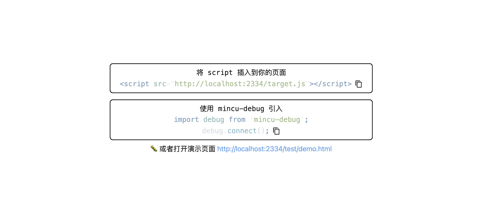
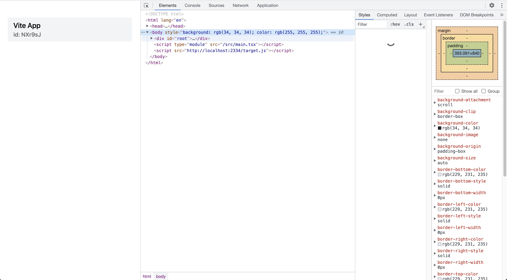
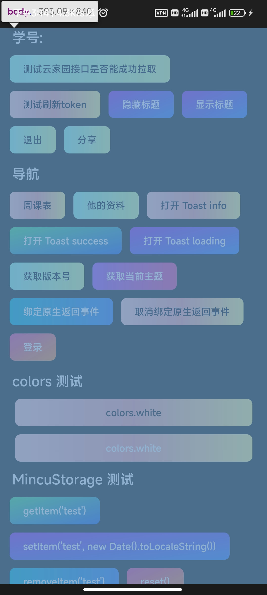

我们提供了 `mincu-debug` 来支持远程调试功能，包含了终端打印远程log，集成 chii 实现 chrome devtools 远程调试等。

## 使用 Devtools 远程调试

### 安装

```bash
# npm
npm i mincu-debug
# yarn
yarn add mincu-debug
# pnpm
pnpm i mincu-debug
```

### 启动 mincu-debug

```bash
mincud
# or
mincu-debug

 ****     **** ** ****     **   ******  **     **
  /**/**   **/**/**/**/**   /**  **////**/**    /**
  /**//** ** /**/**/**//**  /** **    // /**    /**
  /** //***  /**/**/** //** /**/**       /**    /**
  /**  //*   /**/**/**  //**/**/**       /**    /**
  /**   /    /**/**/**   //****//**    **/**    /**
  /**        /**/**/**    //*** //****** //******* 
  //         // // //      ///   //////   ///////  
            Welcome to MINCU Damon!
        !Fast - !Scalable - !Integrated
  
        Mincud listening on ws://localhost:2333
  

> Press "r" | Reload the client page
> Press "d" | Toggle the client devtool
  
2022-08-09 15:01:39 starting chii server at http://localhost:2334
DebugTools listening on http://localhost:23333

# 将会在浏览器打开 http://localhost:23333/
```



### 前端页面与 DevServer 建立连接

```js
import debug from 'mincu-debug'

// 与 DevServer 建立连接
debug.connect()
```

如果要避免将 mincu-debug 打包进 production 环境，可以通过判断 env 环境来动态引入：

```js
// vite
if (import.meta.env.DEV) {
  // only enables it in DEV mode
  import('mincu-debug').then(({ default: debugModule }) => {
    debugModule.connect()
  })
}

// others
if (process.env.NODE_ENV === 'development') {
  import('mincu-debug').then(({ default: debugModule }) => {
    debugModule.connect()
  })
}
```






