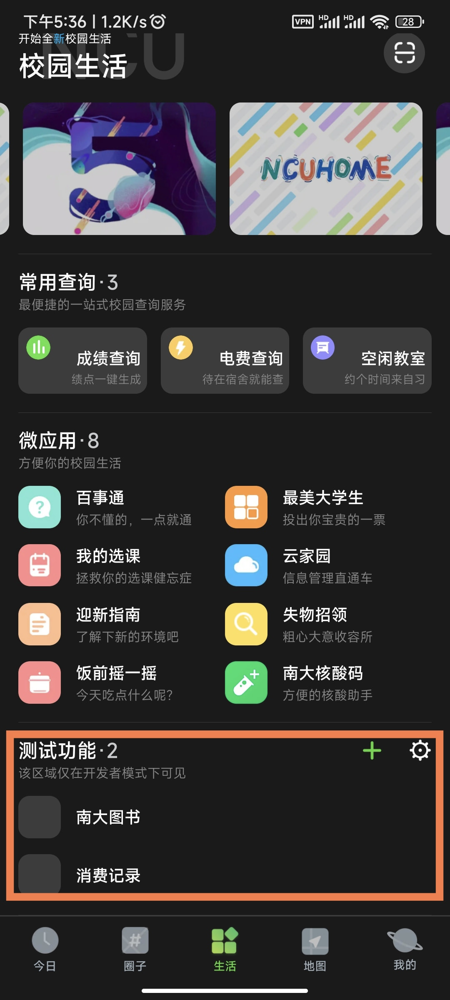
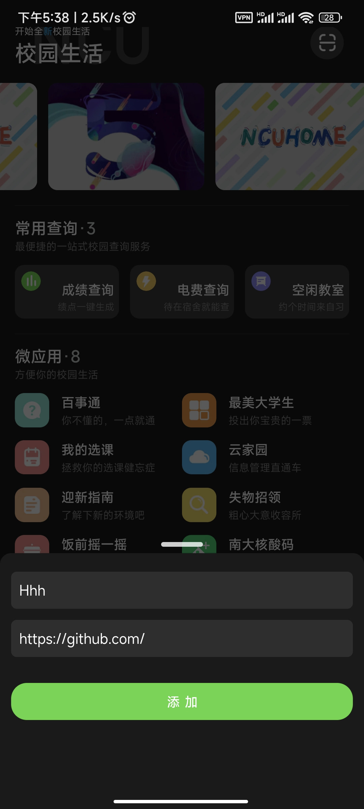
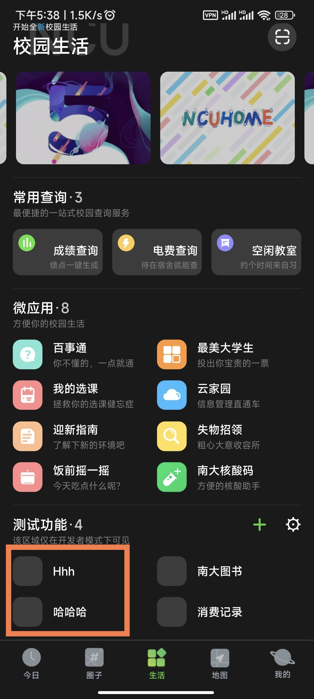

## 加入开发者模式
这一步在安装应用后，数据未清空前，只需要操作一次。

- 首先，下载最新版的[ iNCU](https://incu.ncuos.com/)，然后打开应用 - 切换到生活页 - 右上角扫一扫如下二维码：

- 扫码完毕后，会提示已加入开发者模式，然后 生活页 底部会出现 测试功能板块， 如：

## 添加测试页面

点击测试功能右侧的 + 号，添加测试页面：

> 这里添加的页面地址必须是合法的 URL 地址，否则无法添加，需要带协议前缀， HTTP/HTTPS

添加完毕后就可以看到啦，点击进入页面进行测试：

