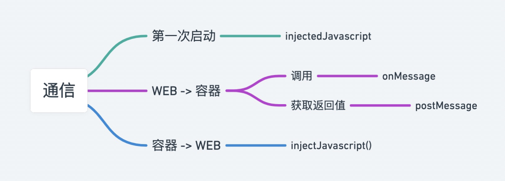
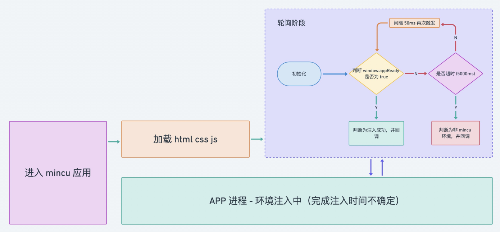
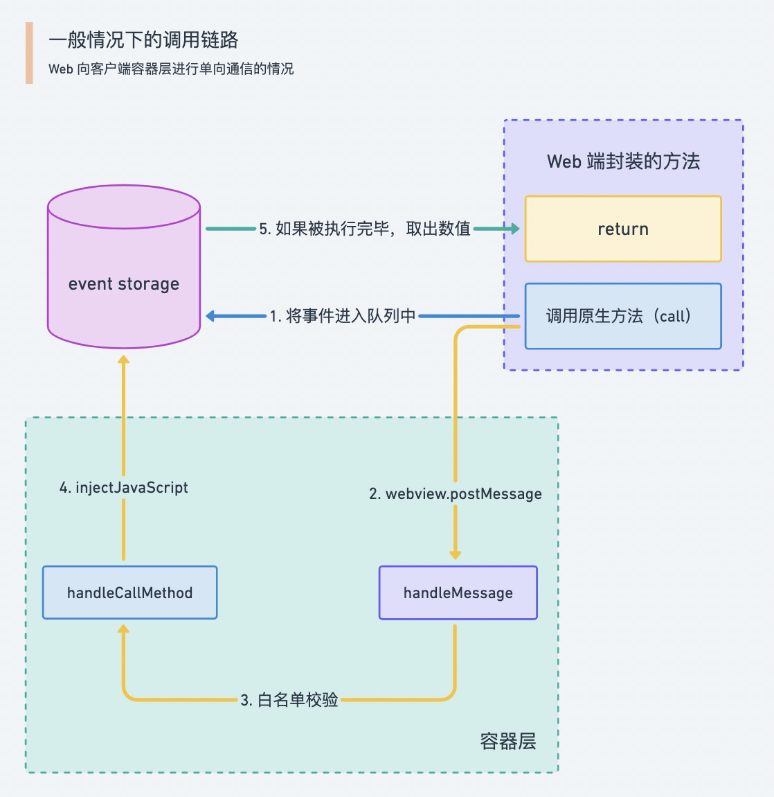
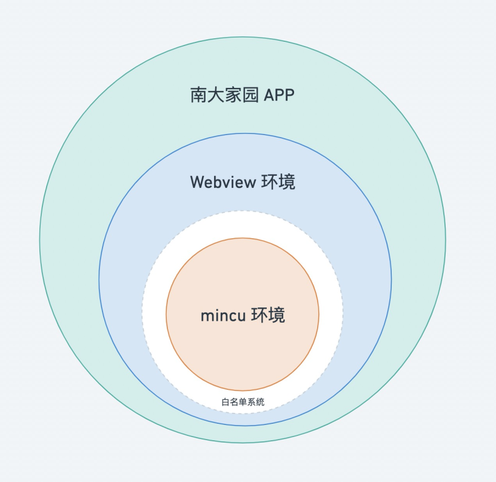

> 本文主要讲述 mincu 主要部分的实现原理，关于 debug 工具的原理，见 [调试指南](/debug)

## 🗺 总览
我们需要实现的需求是：

1. 在 Web 中发送一个事件，然后容器则监听到了该事件；
2. 容器将该事件所对应的方法执行，并给出返回值（或者调用完毕的信号）；
3. 容器将事件所对应的返回值（或者调用完毕的信号）再传给 Web；
4. Web 接收到结果，并响应给事件对应的函数。


在以上的流程之外，我们还要存在一步将对应的 runtime 注入到 Web 中的流程，也就是我们第一次打开页面时，如何将承载以上逻辑的底层代码注入到容器所包裹的 Web 中，并且 Web 能够知道自己处在了这个特殊的环境之中。

## ☎️ 如何做到通信

主要使用了 [react-native-webview](https://github.com/react-native-webview/react-native-webview) 的四个基本的通信 API：

1. **React Native -> Web**: The `injectedJavaScript` prop
2. **React Native -> Web**: The `injectJavaScript` method
3. **Web -> React Native**: The `postMessage` method and `onMessage` prop

根据上述 API，我们采用了以下的通信能力解决方案:

<br />



## 🏫 第一次启动

为什么要将整个流程分为**第一次启动**与**正常情况调用**呢？<br />首先一开始存在两个问题无法回避：

1. 容器注入 Web 的性能（时间）不稳定
1. Web 获取是否注入成功的手段**只能通过 Web 主动获取**

**所以我们第一次启动的时候采用了 Web 端轮询方案，以判断是否在 mincu 容器环境中。**

下面流程图，即当用户通过南大家园打开使用了 mincu 的应用并进入应用页面时所发生的所有事情：

<br />



## 🚥 一般情景的调用链路

这里我们已经通过轮询的方式进入了 mincu 环境了，但如何在 mincu 环境下调用原生 API 并获得它的返回值呢？我们给出了如下的方案。

<br />



## 👯‍♂️ 双向通信

### 四种通信情况

我们所有的通信都可以分为一下四种情况：

1. **Web 对客户端通信**: Web 直接 call 客户端，但无法知晓客户端对该事件 / 方法的处理状态；

2. **客户端对 Web 通信**: 客户端直接 call Web，但无法知晓 Web 对该事件 / 方法的处理状态；

3. **Web 对客户端通信，且 Web 能够获取客户端给的值**: 最为常见的情况，它的解法基本上需要将第一种情况的解决方案搭配第二种情况的解决方案才可实现，之前我们一直讨论的也是这个情况；

4. **客户端对 Web 通信，且客户端能够获取 Web 给的值**: 最不常用 / 基本没有用到。


### 业务场景

而我们 mincu 基本上所有对用户透出的 API 都是**第三种情况**，有极小部分是**第二种情况**（如客户端切换黑夜模式，mincu 应用也要随着客户端配置来切换主题）

#### Native -> Web （第二种情况）

```tsx
import { useNativeState } from 'mincu-react' // or mincu-hooks

const App = () => {
  // 已初始化
  
  // 使用 Native 对 Web 的通信实现颜色主题状态共享
  // 接收 Native 端已注册的可共享状态的变化
  const colorScheme = useNativeState('colorScheme')

  return <div>Current Theme is {colorScheme}</div>
}
```

#### Web -> Native（第三种情况）

```tsx
import { networkModule } from 'mincu-react' // or mincu-network

const App = () => {
  // 已初始化
  
  const refreshToken = async () => {
    // 向 Native 通信，并获取 Native 端的返回值
    const token = await networkModule.refreshToken()
    alert(token)
  }

  return <button onClick={refreshToken}>刷新 token</button>
}
```

## 📦 其他

### 1. 注入优化

在 Web 调用方法后从原生拿去返回值的场景里，我们经常要用到 `injectJavaScript` 方法来动态注入 JS 代码，所以提高其 JS 注入效率是提高调用 API 调用性能的关键。<br />在我们实践中发现，安卓端的 mincu 性能表现在一些方面比 iOS 端的稍差一些，所以经过一些调研，为了想办法提高`injectJavaScript` 的动态注入 JS 的效率，我们基于 [patch-package](https://github.com/ds300/patch-package) 将安卓原生的一部分代码进行了修改。

主要逻辑：

```java
@ReactMethod
public void injectJavaScriptExperimental(int reactTag, String js) {
  UIManagerModule uiManagerModule = getReactApplicationContext().getNativeModule(UIManagerModule.class);
  if (uiManagerModule != null) {
    RNCWebViewManager.RNCWebView webView = (RNCWebViewManager.RNCWebView) uiManagerModule.resolveView(reactTag);
    webView.post(() -> webView.evaluateJavascriptWithFallback(js));
   }
}
```

具体注入方法请查看：[react-native-webview+11.17.1.patch](https://github.com/ncuhome/iNCU/blob/dev/patches/react-native-webview%2B11.17.1.patch)

```diff
diff --git a/node_modules/react-native-webview/android/src/main/java/com/reactnativecommunity/webview/RNCWebViewModule.java b/node_modules/react-native-webview/android/src/main/java/com/reactnativecommunity/webview/RNCWebViewModule.java
index 34fd44b..eda1b4b 100644
--- a/node_modules/react-native-webview/android/src/main/java/com/reactnativecommunity/webview/RNCWebViewModule.java
+++ b/node_modules/react-native-webview/android/src/main/java/com/reactnativecommunity/webview/RNCWebViewModule.java
@@ -22,6 +22,7 @@ import android.util.Log;
 import android.webkit.MimeTypeMap;
 import android.webkit.ValueCallback;
 import android.webkit.WebChromeClient;
+import android.webkit.WebView;
 import android.widget.Toast;
 
 import com.facebook.react.bridge.ActivityEventListener;
@@ -32,6 +33,7 @@ import com.facebook.react.bridge.ReactMethod;
 import com.facebook.react.module.annotations.ReactModule;
 import com.facebook.react.modules.core.PermissionAwareActivity;
 import com.facebook.react.modules.core.PermissionListener;
+import com.facebook.react.uimanager.UIManagerModule;
 
 import java.io.File;
 import java.io.IOException;
@@ -149,6 +151,15 @@ public class RNCWebViewModule extends ReactContextBaseJavaModule implements Acti
     }
   }
 
+  @ReactMethod
+  public void injectJavaScriptExperimental(int reactTag, String js) {
+    UIManagerModule uiManagerModule = getReactApplicationContext().getNativeModule(UIManagerModule.class);
+    if (uiManagerModule != null) {
+      RNCWebViewManager.RNCWebView webView = (RNCWebViewManager.RNCWebView) uiManagerModule.resolveView(reactTag);
+      webView.post(() -> webView.evaluateJavascriptWithFallback(js));
+    }
+  }
+
   public void onActivityResult(Activity activity, int requestCode, int resultCode, Intent data) {
 
     if (filePathCallback == null && filePathCallbackLegacy == null) {
diff --git a/node_modules/react-native-webview/lib/WebView.android.js b/node_modules/react-native-webview/lib/WebView.android.js
index 64025cd..ad8892e 100644
--- a/node_modules/react-native-webview/lib/WebView.android.js
+++ b/node_modules/react-native-webview/lib/WebView.android.js
@@ -127,7 +127,11 @@ var WebView = /** @class */ (function (_super) {
          * functionality, look into postMessage/onMessage.
          */
         _this.injectJavaScript = function (data) {
-            UIManager.dispatchViewManagerCommand(_this.getWebViewHandle(), _this.getCommands().injectJavaScript, [data]);
+            const tag = _this.webViewRef.current._nativeTag
+            if (tag) {
+                NativeModules.RNCWebView.injectJavaScriptExperimental(tag, data)
+            }
+            // UIManager.dispatchViewManagerCommand(_this.getWebViewHandle(), _this.getCommands().injectJavaScript, [data]);
         };
         /**
          * We return an event with a bunch of fields including:
```

### 2. 关于白名单

白名单是隔离一般 Webview 环境与 mincu 环境的一个重要的特性，之所以要有白名单，是因为我们开放了南大家园的扫码能力与 deep link 功能，所以为了避免产生安全风险，我们将容器注入 mincu runtime 前增加了这一卡口。

白名单系统会默认放行 *.ncuos.com 的域名进入 mincu 环境中，其他域名都不会被注入 mincu runtime。

<br />



而目前正式版客户端绕过白名单的方法有两个：

1. 进入「开发者模式」，如何进入该模式会在另一篇「开发与调试指引」中给出，这个适合开发者对 mincu app 进行调试；

2. 通过南大家园微应用授权中转页，在中转页种，将外部的 url 注入到客户端白名单系统里，然后再进行跳转，这种情况适用于外部开发者去部署自己的 mincu app。


